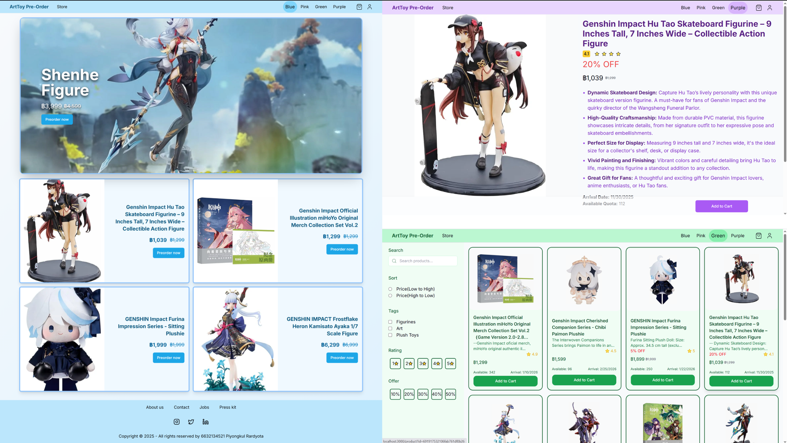
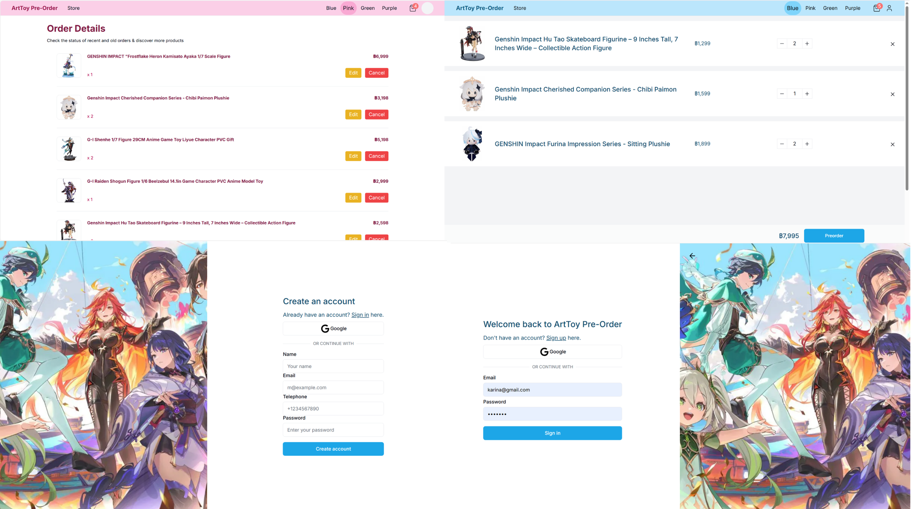
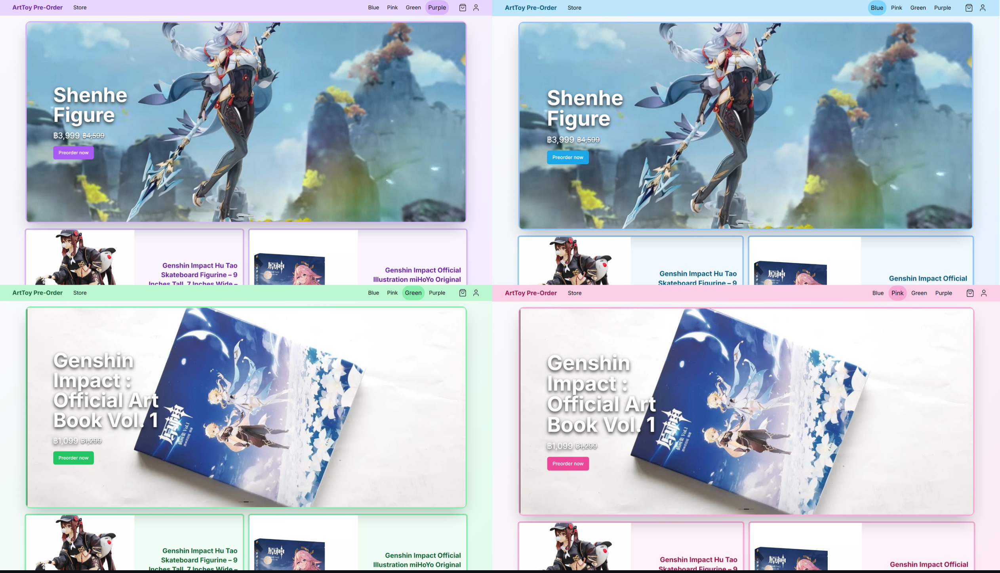
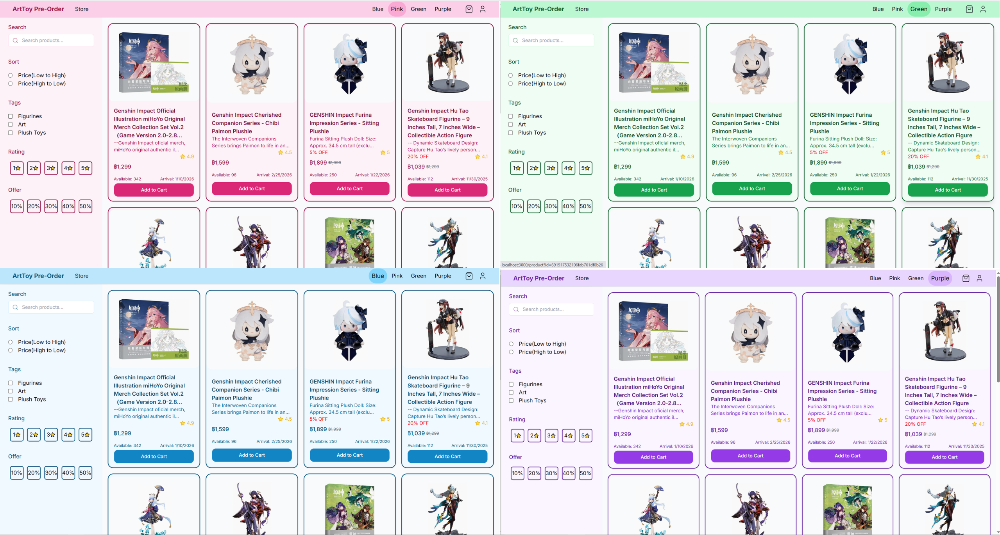
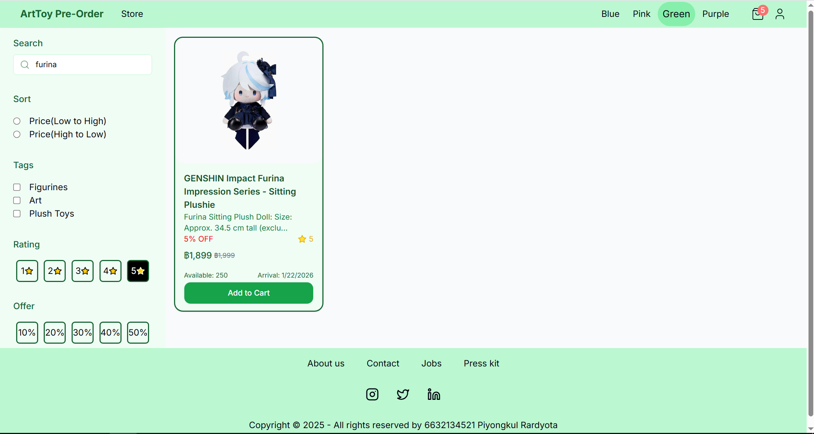
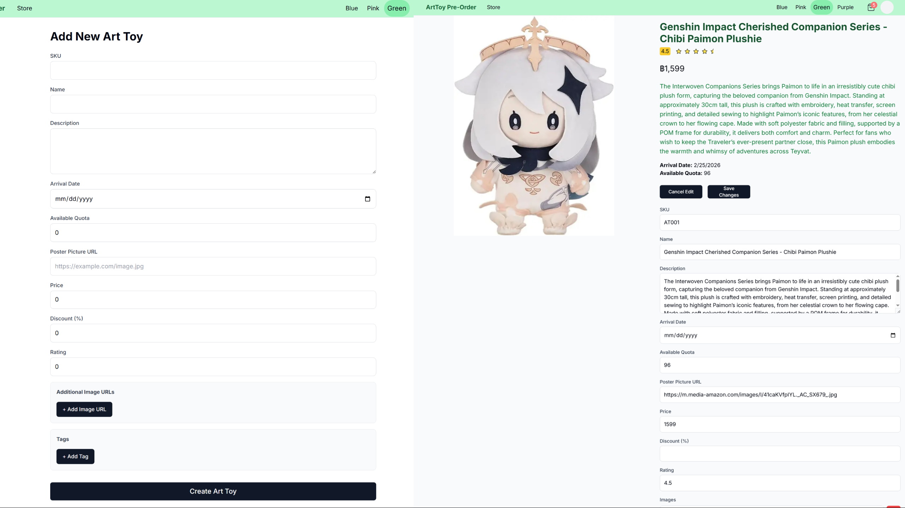

# Art Toy Pre-Order Site

**Course:** Software Development Practice II (2110507)  
**Semester:** Year 3, Semester 1  
**University:** Chulalongkorn University  
**By:** Piyongkul Rardyota (6632135421)  
**Tech Stack:** TypeScript, React, Node.js, Express, MongoDB, Tailwind CSS

## 📖 About the Project
A full-stack e-commerce platform engineered specifically for the Art Toy market. The application features a dynamic, user-centric frontend and a robust, secure RESTful API backend. It solves the challenge of inventory management and user engagement through a custom-built "Smart Search" engine and a flexible theming architecture.

https://github.com/user-attachments/assets/f01ef8b5-a1de-4d2b-91c1-07bd88e33886

## ✨Key Features
### 🎨 Dynamic Theming Engine
**The Challenge:** Users require personalized viewing experiences, but hard-coding themes creates technical debt.  
**The Solution:** Implemented a global state management system using React Context and Tailwind CSS. This allows real-time, seamless theme switching across the entire application without page reloads.
  
  

https://github.com/user-attachments/assets/548f7a78-e04f-492a-86aa-fa3ff0583a02

### 🔎"Smart Search" & Advanced Filtering
**The Challenge:** Standard database queries often fail to find relevant products if the user makes typos or uses vague keywords.  
**The Solution:** Developed a sophisticated search algorithm using **MongoDB Aggregation Pipelines**.
* **Fuzzy Matching:** Capable of finding products by partial keywords, names, or tags.
* **Multi-Layered Filtering:** Users can simultaneously filter by logic (AND/OR), price range, discount percentage, and category tags.

https://github.com/user-attachments/assets/5021ae07-51a5-46cc-ac47-160457d60328

### 🛡️Security
Prioritized security best practices to protect user data and prevent common web vulnerabilities:
* **Authentication:** Secure JWT-based stateless authentication with strict cookie policies.
* **RBAC (Role-Based Access Control):** distinct middleware protection for Admin vs. User routes.
* **Defense Layers:**
    * `bcryptjs` for salt-hashed password storage.
    * `express-rate-limit` (100 req/10min) to prevent DDoS/Brute-force attacks.
    * `helmet` for HTTP header hardening.
    * Sanitization against XSS and NoSQL Injection attacks.

### 👑Admin Management Portal
Designed a separated, secured GUI for administrators to manage inventory (CRUD operations) without needing direct database access, streamlining the operational workflow.
  

https://github.com/user-attachments/assets/3b0b5690-85b4-4022-820a-70b8e34352a7

## 🛠 Tech Stack & Tools

| Category | Technologies |
|----------|--------------|
| **Core Languages** | TypeScript, JavaScript (ES6+) |
| **Frontend** | React.js, Tailwind CSS, Vite |
| **Backend** | Node.js, Express.js |
| **Database** | MongoDB (with Mongoose ODM) |
| **Security** | JWT, Bcrypt, Helmet, CORS |
| **DevOps/Tools** | Git, Vercel, VS Code |
